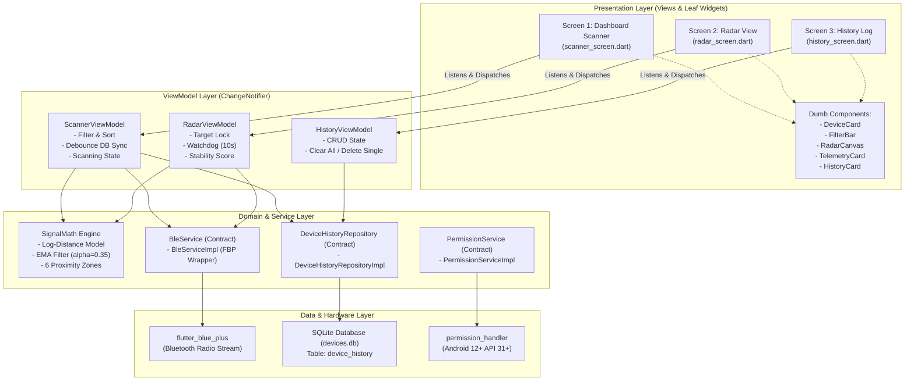

# BluePulse (com.bluepulse.app)

[](https://flutter.dev)
[](https://dart.dev)
[](docs/SYSTEM_ARCHITECTURE_SPEC.md)
[](test/)
[](https://m3.material.io/)
[](https://developer.android.com)
[](https://github.com/FajarRAP/blue-pulse/releases/tag/v1.0.0%2B1)

**BluePulse** adalah aplikasi seluler pelacak kedekatan sinyal *Bluetooth Low Energy* (BLE) dan visualisasi radar real-time berkinerja tinggi yang dibangun menggunakan **Flutter 3.47+** dan **Dart 3.13+**. Proyek ini dikembangkan secara komprehensif dari hulu ke hilir sebagai penyelesaian studi kasus teknis *Goodeva Mobile Engineer*, mengedepankan prinsip arsitektur *Clean MVVM*, *anti-overengineering*, ketahanan terhadap *edge cases*, serta kualitas kode tingkat produksi (*production-ready*).

---

## Daftar Isi
- [1. Executive Summary & Product Vision](#1-executive-summary--product-vision)
- [2. Requirement Traceability Matrix](#2-requirement-traceability-matrix)
- [3. Arsitektur Sistem & Data Flow](#3-arsitektur-sistem--data-flow)
- [4. Tech Stack Rationale](#4-tech-stack-rationale)
- [5. Teori Sinyal & Formula Matematika](#5-teori-sinyal--formula-matematika)
- [6. Rancangan Layar Aplikasi (Walkthrough 3 Layar)](#6-rancangan-layar-aplikasi-walkthrough-3-layar)
- [7. Resilience, Edge Cases & App Lifecycle](#7-resilience-edge-cases--app-lifecycle)
- [8. Panduan Setup, Menjalankan, & Testing](#8-panduan-setup-menjalankan--testing)
- [9. Asumsi Teknis & Kendala yang Dihadapi](#9-asumsi-teknis--kendala-yang-dihadapi)
- [10. Dokumentasi Keterbatasan (Known Issues)](#10-dokumentasi-keterbatasan-known-issues)
- [11. Build Artifact & Panduan Instalasi](#11-build-artifact--panduan-instalasi)
- [12. Indeks Dokumen Teknis Mendalam](#12-indeks-dokumen-teknis-mendalam)

---

## 1. Executive Summary & Product Vision

### 1.1. Latar Belakang Masalah
Dalam ekosistem *Internet of Things* (IoT) dan manajemen aset modern, pelacakan fisik perangkat pemancar BLE (*beacon*, *smart tag*, periferal BLE) sering kali terkendala oleh fluktuasi sinyal frekuensi radio yang ekstrem akibat *multipath fading*, halangan fisik, dan keterbatasan visualisasi antarmuka pengguna yang kaku. Pengguna membutuhkan aplikasi yang tidak hanya memindai alamat MAC dan nama perangkat, melainkan mampu mengonversi telemetri kekuatan sinyal (*Received Signal Strength Indicator* / RSSI) menjadi estimasi jarak nyata, memberikan navigasi spasial melalui radar dinamis, serta mendokumentasikan riwayat deteksi secara lokal tanpa ketergantungan koneksi internet.

### 1.2. Visi Produk BluePulse
BluePulse menghadirkan solusi pelacakan BLE interaktif yang menggabungkan:
1. **Pemindaian Reaktif Real-Time**: Aliran pemindaian kontinu dengan kemampuan filter ambang batas desibel dan pengurutan dinamis berdasarkan kedekatan.
2. **Visualisasi Radar Berdenyut (Pulse Radar)**: Layar pemantauan target tunggal yang memproyeksikan estimasi jarak ke dalam lingkaran konsentris 6 zona dengan animasi rotasi sapuan (*radar sweep*) dan indikator stabilitas sinyal.
3. **Persistensi Lokal Berkinerja Tinggi**: Pencatatan riwayat perangkat ke dalam basis data relasional SQLite dengan kebijakan *upsert debounce* guna menjaga efisiensi I/O disk.
4. **Filosofi Rekayasa (Pragmatic & Production-Ready)**:
   - **Anti-Overengineering**: Menghindari abstraksi artifisial seperti *UseCase* 1-baris yang hanya meneruskan fungsi repository, serta menolak pembuatan layer DTO ganda yang tidak memberikan nilai tambah.
   - **Deterministic Reactive Flow**: Memanfaatkan *Streams* asli perangkat keras Bluetooth melalui pipeline matematis sebelum tiba di lapisan presentasi.
   - **Resilience by Default**: Kegagalan subsistem Bluetooth (Bluetooth dimatikan tiba-tiba, izin runtime ditolak, aplikasi berpindah ke latar belakang) diisolasi menjadi status reaktif yang aman bagi antarmuka pengguna, bebas dari *unhandled exception* atau *crash*.

---

## 2. Requirement Traceability Matrix

Tabel berikut memetakan setiap butir spesifikasi studi kasus Goodeva Mobile Engineer ke modul implementasi kode dan rekam jejak *Pull Request* (PR) di repositori:

| No | Kebutuhan Studi Kasus Goodeva | Modul Kode Implementasi | PR & Commit Ref | Status |
| :---: | :--- | :--- | :---: | :---: |
| **1** | **Fondasi Arsitektur & Dependency Injection**<br>Setup Clean Architecture, Service Locator, Material 3, Android 12+ BLE Permissions | [`lib/core/di/injection.dart`](lib/core/di/injection.dart)<br>[`lib/core/constants/app_colors.dart`](lib/core/constants/app_colors.dart)<br>[`android/app/src/main/AndroidManifest.xml`](android/app/src/main/AndroidManifest.xml) | PR #1 (`feat/milestone-1-setup-foundation`) | **100% Selesai** |
| **2** | **Signal Processing Engine & Telemetri**<br>Log-Distance Path Loss ($d$), EMA Smoothing ($\alpha=0.35$), Klasifikasi 6 Zona Kedekatan | [`lib/core/utils/signal_math.dart`](lib/core/utils/signal_math.dart)<br>[`lib/core/constants/app_constants.dart`](lib/core/constants/app_constants.dart) | PR #2 (`feat/milestone-2-signal-math-persistence-ble`) | **100% Selesai** |
| **3** | **Persistensi Lokal Relasional (Setara Room)**<br>SQLite database `devices.db`, skema tabel `device_history`, indeks `last_seen DESC`, atomic upsert | [`lib/data/datasources/local_database.dart`](lib/data/datasources/local_database.dart)<br>[`lib/data/repositories/device_history_repository.dart`](lib/data/repositories/device_history_repository.dart)<br>[`lib/data/models/ble_device_model.dart`](lib/data/models/ble_device_model.dart) | PR #2 (`feat/milestone-2-signal-math-persistence-ble`) | **100% Selesai** |
| **4** | **Layar 1: Dashboard Scanner BLE**<br>Pemindaian otomatis saat startup, start/stop toggle, pencarian nama/MAC, filter chip RSSI (≥ -80, -70, -60 dBm), auto-sort sinyal terkuat | [`lib/viewmodels/scanner_viewmodel.dart`](lib/viewmodels/scanner_viewmodel.dart)<br>[`lib/views/scanner/scanner_screen.dart`](lib/views/scanner/scanner_screen.dart)<br>[`lib/views/scanner/widgets/filter_bar.dart`](lib/views/scanner/widgets/filter_bar.dart)<br>[`lib/views/scanner/widgets/device_card.dart`](lib/views/scanner/widgets/device_card.dart) | PR #3 (`feat/milestone-3-dashboard-scanner`) | **100% Selesai** |
| **5** | **Layar 2: Radar Tracking View**<br>CustomPainter radar 5 cincin konsentris, rotasi sweep, blip perangkat berdenyut, telemetri (raw/smoothed RSSI, packet rate, stability score), watchdog signal lost 10 detik | [`lib/viewmodels/radar_viewmodel.dart`](lib/viewmodels/radar_viewmodel.dart)<br>[`lib/views/radar/radar_screen.dart`](lib/views/radar/radar_screen.dart)<br>[`lib/views/radar/widgets/radar_canvas.dart`](lib/views/radar/widgets/radar_canvas.dart)<br>[`lib/views/radar/widgets/telemetry_card.dart`](lib/views/radar/widgets/telemetry_card.dart) | PR #4 (`feat/milestone-4-radar-screen`) | **100% Selesai** |
| **6** | **Layar 3: Riwayat Perangkat (History Log)**<br>Membaca riwayat tersimpan, format timestamp relatif ("Baru saja", "5 mnt lalu"), hapus per perangkat, hapus semua, navigasi ke radar | [`lib/viewmodels/history_viewmodel.dart`](lib/viewmodels/history_viewmodel.dart)<br>[`lib/views/history/history_screen.dart`](lib/views/history/history_screen.dart)<br>[`lib/views/history/widgets/history_card.dart`](lib/views/history/widgets/history_card.dart)<br>[`lib/core/utils/time_formatter.dart`](lib/core/utils/time_formatter.dart) | PR #5 (`feat/milestone-5-history-log`) | **100% Selesai** |
| **7** | **Siklus Hidup Aplikasi (App Lifecycle)**<br>Otomatis hentikan scanning saat aplikasi masuk background (`paused`/`inactive`), resume scanning saat aplikasi kembali ke foreground (`resumed`) | [`lib/main.dart`](lib/main.dart)<br>[`lib/viewmodels/scanner_viewmodel.dart`](lib/viewmodels/scanner_viewmodel.dart) | PR #6 (`feat/milestone-6-7-lifecycle-resilience-qa`) | **100% Selesai** |
| **8** | **Resilience & Penanganan Kasus Batas (Edge Cases)**<br>Deteksi Bluetooth mati mendadak (banner offline), permission dialog & shortcut settings, penanganan rotasi layar tanpa kehilangan state | [`lib/services/permission_service.dart`](lib/services/permission_service.dart)<br>[`lib/views/scanner/widgets/ble_warning_banner.dart`](lib/views/scanner/widgets/ble_warning_banner.dart)<br>[`lib/views/scanner/widgets/ble_permission_dialog.dart`](lib/views/scanner/widgets/ble_permission_dialog.dart) | PR #6 (`feat/milestone-6-7-lifecycle-resilience-qa`) | **100% Selesai** |
| **9** | **Pengujian Komprehensif (Quality Assurance)**<br>27+ test suite (80 test assertions) mencakup Unit Test (Signal Math, SQLite, ViewModels), Lifecycle Test, Widget Smoke & Interaction Test | [`test/unit/signal_math_test.dart`](test/unit/signal_math_test.dart)<br>[`test/unit/app_lifecycle_test.dart`](test/unit/app_lifecycle_test.dart)<br>[`test/widget_test.dart`](test/widget_test.dart) | PR #2, #3, #4, #5, #6 | **100% Passed (80/80)** |

---

## 3. Arsitektur Sistem & Data Flow

BluePulse menerapkan pola arsitektur **Clean MVVM** (*Model-View-ViewModel*) yang disesuaikan secara pragmatis untuk Flutter. Setiap lapisan memiliki batas tanggung jawab (*separation of concerns*) yang jelas, mudah diuji, dan modular.

### 3.1. Diagram Alir Arsitektur (Mermaid)



### 3.2. Pemisahan Tanggung Jawab Antar-Lapisan
1. **Presentation Layer (Pure Dumb Components & Screen Wrappers)**:
   - Komponen antarmuka pengguna (`DeviceCard`, `FilterBar`, `RadarCanvas`, `TelemetryCard`, `HistoryCard`) dirancang sebagai **Dumb Widgets / Pure Components**. Komponen ini hanya menerima data entitas primitif atau model melalui konstruktor dan mengalirkan aksi pengguna ke luar melalui fungsi *callback* (`onTap`, `onDelete`, `onChanged`).
   - Komponen *leaf* sama sekali tidak mengakses Service Locator (`locator<...>()`) ataupun memicu efek samping (*side-effects*).
   - Layar utama bertindak sebagai *Smart Container* yang mengikat *state* dari `ViewModel` ke dalam *dumb widgets* menggunakan `ListenableBuilder` native.
2. **ViewModel Layer (`ChangeNotifier`)**:
   - Menampung seluruh logika presentasi, status UI, kalkulasi turunan (*derived states* seperti filter dan pengurutan), serta orkestrasi panggilan *service*.
   - Tidak memiliki dependensi ke elemen visual atau layout (`material_ui`), sehingga dapat diuji secara terisolasi murni dengan *unit tests*.
3. **Domain & Service Layer**:
   - Berisi kontrak antarmuka (`abstract interface class`) murni tanpa *Hungarian notation* (mengikuti standar *Effective Dart*).
   - `SignalMath`: Mesin kalkulasi murni (*pure mathematical functions*) tanpa *state*.
4. **Data & Hardware Layer**:
   - `BleServiceImpl`: Membungkus *package* pihak ketiga `flutter_blue_plus` dan mentransformasikannya menjadi *stream* domain yang deterministik.
   - `LocalDatabase` & `DeviceHistoryRepositoryImpl`: Mengelola koneksi SQLite dan serialisasi data relasional.

---

## 4. Tech Stack Rationale

Pemilihan pustaka dan komponen teknologi didasarkan pada analisis mendalam mengenai performa, stabilitas rilis, kemudahan pengujian, dan kepatuhan terhadap standar industri:

| Teknologi / Pustaka | Versi | Justifikasi Pemilihan & Rationale Teknis |
| :--- | :---: | :--- |
| **Flutter SDK** | `^3.47.2` | Framework multiplatform reaktif dengan mesin *rendering* performa tinggi (Impeller / Skia) yang menjamin kelancaran animasi sapuan radar dan *pulsing blip* pada 60–120 FPS. |
| **Dart SDK** | `^3.13.2` | Membawa fitur sintaks modern: *Primary Constructors* untuk model tanpa boilerplate, *Dot Shorthands* untuk kode ringkas dan *type-safe*, serta *Sealed Classes* untuk pemodelan status yang *exhaustive*. |
| **`flutter_blue_plus`** | `^1.36.8` | Pustaka BLE terpopuler dan teraktif di ekosistem Flutter. Mendukung Bluetooth 5.0+, penanganan *thread-safe scanning*, serta kompatibel penuh dengan perubahan izin Bluetooth pada Android 12+ (API 31+). |
| **`sqflite` + `path`** | `^2.3.3+1` | Standar industri untuk persistensi basis data relasional di Flutter (setara dengan *Room Persistence Library* pada Android native). Menyediakan performa transaksi atomic, *B-Tree indexing*, dan eksekusi kueri cepat. |
| **`get_it`** | `^7.7.0` | *Service Locator* berkecepatan tinggi dengan waktu akses $O(1)$. Mengeliminasi kebutuhan *context passing* untuk layer bisnis dan mempermudah penggantian implementasi dengan *mock object* saat pengujian unit. |
| **`material_ui`** | `^1.0.0` | Mengadopsi arsitektur decoupling resmi Flutter 3.47+ di mana komponen Material 3 dipisahkan dari inti framework ke pustaka mandiri. Layer presentasi mengimpor `material_ui`, sementara layer bisnis tetap *design-agnostic*. |
| **`permission_handler`** | `^11.4.0` | Menangani izin *runtime* Android 12+ secara modular (`BLUETOOTH_SCAN`, `BLUETOOTH_CONNECT`) serta *fallback* ke izin lokasi pada Android 11 ke bawah. |
| **`intl`** | `^0.19.0` | Digunakan untuk kalkulasi penanggalan dan pemformatan selisih waktu relatif (*relative timestamp*) pada riwayat perangkat. |

### 4.1. Standar Sintaks Modern Dart 3.13+
Proyek ini mengadopsi standar penulisan kode modern Dart:
- **[Dot Shorthands](https://dart.dev/language/dot-shorthands)**: Mengurangi redundansi saat tipe konteks telah diketahui compiler:
  ```dart
  alignment: .center,
  fontWeight: .bold,
  colorScheme: .fromSeed(seedColor: AppColors.primarySeed),
  status: .scanning,
  ```
- **[Primary Constructors](https://dart.dev/language/primary-constructors)**: Deklarasi konstruktor langsung pada header kelas model (`BleDeviceModel`) dengan *named parameters* eksplisit, mengeliminasi duplikasi *boilerplate field assignments*.
- **Omit Redundant Types**: Menghilangkan anotasi tipe data yang redundan di sisi kiri jika ekspresi di sisi kanan sudah jelas (memaksimalkan *type inference*).

---

## 5. Teori Sinyal & Formula Matematika

Pemrosesan sinyal Bluetooth Low Energy pada BluePulse ditangani oleh modul [`SignalMath`](lib/core/utils/signal_math.dart). Detail matematis lengkap dapat diakses pada dokumen spesifik [docs/SIGNAL_MATHEMATICS.md](docs/SIGNAL_MATHEMATICS.md).

### 5.1. Log-Distance Path Loss Model (Estimasi Jarak)
Perambatan gelombang radio frekuensi 2.4 GHz di udara mengalami pelemahan daya (*attenuation*) seiring bertambahnya jarak. Hubungan antara daya sinyal yang diterima (**RSSI**) dan jarak fisik ($d$ dalam meter) dirumuskan melalui *Log-Distance Path Loss Model*:

$$\text{RSSI} = \text{TxPower} - 10 \cdot n \cdot \log_{10}(d)$$

Dengan menyelesaikan persamaan di atas untuk mencari jarak $d$, diperoleh formula estimasi jarak:

$$d = 10^{\left(\frac{\text{TxPower} - \text{RSSI}}{10 \cdot n}\right)}$$

#### Parameter & Nilai Konstanta:
- **$\text{RSSI}$ (*Received Signal Strength Indicator*)**: Nilai kekuatan sinyal yang ditangkap oleh antena ponsel cerdas (dalam satuan dBm).
- **$\text{TxPower}$**: Daya pancar sinyal terkalibrasi pada jarak referensi tepat 1 meter. Menggunakan nilai standar industri default **`-59 dBm`** (`AppConstants.defaultTxPower`) jika tidak dipancarkan secara eksplisit dalam paket *advertising* perangkat.
- **$n$ (*Path-Loss Exponent*)**: Koefisien redaman propagasi lingkungan. Nilai default ditetapkan ke **`2.4`** (`AppConstants.defaultPathLossExponent`), yang merepresentasikan lingkungan dalam ruangan (*indoor office/home*) dengan hambatan partisi dan furnitur ringan.

#### Penanganan Kasus Batas (*Boundary Conditions*):
1. **$\text{RSSI} \ge 0\text{ dBm}$**: Secara fisik tidak mungkin terjadi pada penerimaan sinyal pasif di ponsel (mengindikasikan malfungsi sensor hardware). Fungsi mengembalikan nilai aman `-1.0` (*N/A*).
2. **$\text{RSSI} < -95\text{ dBm}$**: Berada di bawah ambang batas sensitivitas (*noise floor*) penerima RF. Sinyal dikategorikan terputus/hilang dan menghasilkan `-1.0`.

---

### 5.2. Exponential Moving Average / EMA (Peredaman Jitter)
Sinyal radio BLE di dunia nyata sangat rentan terhadap *multipath fading* (pantulan sinyal dari dinding dan lantai) serta redaman tubuh manusia (*body shadowing*). Fenomena ini menyebabkan lonjakan (*jitter*) drastis pada nilai RSSI mentah. 

Untuk menghasilkan pergerakan radar dan indikator yang stabil tanpa menghilangkan responsivitas terhadap pergerakan fisik pengguna, diterapkan filter **Exponential Moving Average (EMA)**:

$$\text{RSSI}_{\text{smoothed}} = \alpha \cdot \text{RSSI}_{\text{current}} + (1 - \alpha) \cdot \text{RSSI}_{\text{prev}}$$

#### Parameter Filter:
- **$\alpha$ (*Smoothing Factor*)**: Ditetapkan pada **`0.35`** (`AppConstants.defaultEmaAlpha`). Nilai ini memberikan rasio kompromi ideal: cukup responsif mendeteksi perpindahan jarak fisik pengguna (< 0.5 detik lag) namun efektif menyaring fluktuasi *spike noise*.
- **Inisialisasi *Cold Start***: Ketika perangkat pertama kali terdeteksi ($\text{RSSI}_{\text{prev}} == 0$), filter langsung mengadopsi $\text{RSSI}_{\text{current}}$ untuk menghindari bias nilai awal nol.

---

### 5.3. Tabel Klasifikasi 6 Zona Kedekatan (Proximity Zones)
Sesuai tabel spesifikasi studi kasus Goodeva, spektrum kekuatan sinyal diklasifikasikan ke dalam 6 zona kedekatan diskret dengan kode warna telemetri semantik yang konsisten:

| Rentang RSSI (dBm) | Enum `ProximityZone` | Label UI | Perkiraan Jarak | Token Warna Telemetri | Kode Hex |
| :---: | :---: | :---: | :---: | :---: | :---: |
| **-10 s/d -30 dBm** | `.veryStrong` | Sangat Kuat | `< 1 meter` | `AppColors.signalVeryStrong` | `#00C853` (Hijau Terang) |
| **-30 s/d -50 dBm** | `.strong` | Kuat | `1 – 3 meter` | `AppColors.signalStrong` | `#00B0FF` (Cyan / Biru Muda) |
| **-50 s/d -70 dBm** | `.fair` | Cukup | `3 – 10 meter` | `AppColors.signalFair` | `#FFD600` (Kuning / Amber) |
| **-70 s/d -80 dBm** | `.weak` | Lemah | `10 – 20 meter` | `AppColors.signalWeak` | `#FF9100` (Oranye) |
| **-80 s/d -90 dBm** | `.veryWeak` | Sangat Lemah | `> 20 meter` | `AppColors.signalVeryWeak` | `#FF1744` (Merah) |
| **< -90 dBm** atau $\ge 0$ | `.lost` | Sinyal Hilang | `Terputus / Luar Jangkauan` | `AppColors.signalLost` | `#9E9E9E` (Abu-abu) |

---

## 6. Rancangan Layar Aplikasi (Walkthrough 3 Layar)

BluePulse mengimplementasikan 3 layar navigasi utama dengan pemisahan komponen murni (*Dumb Component*) dan dukungan *preview*:

```
ScannerScreen (Layar 1) ──[Tap Device]──> RadarScreen (Layar 2)
         │
    [Tap Icon]
         │
         ▼
HistoryScreen (Layar 3) ──[Tap History Card]──> RadarScreen (Layar 2)
```

### 6.1. Layar 1: Dashboard Utama (Scanner)
Layar pertama yang tampil saat aplikasi dibuka. Berfungsi sebagai pusat pemantauan pemindaian BLE secara menyeluruh:
- **Header & Ringkasan Pemindaian**: Menampilkan status pemindai (Sedang Memindai / Pemindaian Berhenti), status Bluetooth, dan jumlah total perangkat unik yang ditemukan.
- **Kontrol Start/Stop**: Tombol aksi dinamis yang memicu atau menghentikan aliran pemindaian perangkat keras Bluetooth.
- **Bilah Filter & Pencarian (`FilterBar`)**:
  - Kolom teks pencarian yang melakukan penyaringan *real-time* (pencarian nama perangkat dan alamat MAC/UUID secara *case-insensitive*).
  - Pilihan *Filter Chips* ambang batas sinyal: **Semua**, **$\ge -80\text{ dBm}$**, **$\ge -70\text{ dBm}$**, dan **$\ge -60\text{ dBm}$**.
- **Daftar Perangkat (`DeviceCard`)**:
  - Menampilkan nama perangkat, alamat MAC (dengan tipografi *monospace*), badge RSSI mentah (`-45 dBm`), estimasi jarak terhitung (`1.5 m`), dan pill status zona kedekatan berwarna.
  - Secara otomatis diurutkan berdasarkan kekuatan sinyal terkuat (**RSSI descending**).
  - Mengetuk (*tap*) salah satu kartu perangkat akan membuka **Layar 2 (Radar View)**.
  - Ikon navigasi pada AppBar membuka **Layar 3 (History Log)**.

### 6.2. Layar 2: Detail Pelacakan (Radar View)
Layar pelacakan target spasial mendalam terhadap satu perangkat BLE terpilih:
- **Kanvas Radar Interaktif (`RadarCanvas`)**:
  - Digambar menggunakan `CustomPainter` dengan 5 lingkaran konsentris terkalibrasi (`<1m`, `1-3m`, `3-10m`, `10-20m`, `>20m`).
  - Animasi rotasi garis sapuan radar (*sweeping beam*) secara halus (360 derajat kontinu).
  - Titik *blip* target diposisikan secara proporsional sesuai estimasi jarak fisik nyata dengan efek lingkaran denyut (*pulsing ping*) setiap kali ada paket sinyal baru yang diterima.
  - Warna cincin dan titik *blip* berubah dinamis sesuai zona kedekatan saat ini.
- **Kartu Metrik Telemetri (`TelemetryCard`)**:
  - Grid metrik informatif yang merinci:
    1. **Raw RSSI vs Smoothed RSSI**: Menampilkan desibel mentah dan desibel setelah filter EMA.
    2. **Estimasi Jarak**: Jarak dalam satuan meter (presisi 1 desimal).
    3. **Skor Stabilitas Sinyal**: Persentase kestabilan sinyal berdasarkan variansi perubahan RSSI (Stabil / Cukup Stabil / Fluktuatif).
    4. **Packet Rate & Heartbeat**: Frekuensi penerimaan paket iklan (*packets/sec*).
    5. **Last Seen**: Waktu kedatangan paket data terakhir.
- **Watchdog Sinyal Hilang (10 Detik)**:
  - Timer berkala yang mendeteksi jika perangkat tidak lagi mengirimkan paket iklan selama lebih dari 10 detik. Jika batas waktu tercapai, status visual target otomatis dialihkan ke `.lost` (Sinyal Hilang / Abu-abu).
- **Banner Offline Bluetooth**: Menampilkan indikator peringatan jika pengguna mematikan Bluetooth saat berada di layar radar.

### 6.3. Layar 3: Riwayat Perangkat (History Log)
Layar arsip yang memuat seluruh perangkat yang pernah terdeteksi oleh BluePulse secara persisten:
- **Penyimpanan Lokal Relasional**: Seluruh data dibaca dari basis data SQLite `devices.db`.
- **Kartu Riwayat (`HistoryCard`)**:
  - Menampilkan nama perangkat, alamat MAC, sinyal terakhir yang tercatat, dan kategori zona.
  - Dilengkapi format waktu relatif menggunakan modul [`TimeFormatter`](lib/core/utils/time_formatter.dart) (misal: *"Baru saja"*, *"5 menit yang lalu"*, *"Kemarin 14:20"*).
- **Aksi Penghapusan Data**:
  - Ikon hapus pada masing-masing kartu memunculkan dialog konfirmasi untuk menghapus satu entri.
  - Tombol pada AppBar memunculkan dialog konfirmasi untuk mengosongkan seluruh riwayat basis data (*Clear All*).
- **Akses Cepat ke Radar**: Mengetuk salah satu entri riwayat akan langsung mengarahkan pengguna ke Layar Radar untuk melacak kembali perangkat tersebut.

### 6.4. Fitur Pratinjau Widget (`@BluePulsePreview`)
Seluruh komponen *dumb widget* dan layar BluePulse dilengkapi dengan fungsi *preview* terisolasi menggunakan anotasi `@BluePulsePreview` ([`lib/core/utils/preview_annotations.dart`](lib/core/utils/preview_annotations.dart)). Fitur ini memungkinkan tim pengembang memeriksa tampilan UI secara cepat tanpa perlu menjalankan simulator fisik atau menghubungkan pemancar BLE nyata.
- Pratinjau mencakup berbagai variasi status: *Empty State*, *Active Scanning*, *High Density Devices*, *Radar Active Tracking*, *Radar Signal Lost*, *History Populated*, dan *History Empty*.

---

## 7. Resilience, Edge Cases & App Lifecycle

Aplikasi mobile tingkat produksi harus mampu bertahan terhadap perubahan lingkungan operasional tanpa mengalami *crash* atau *memory leak*:

### 7.1. Pengelolaan Siklus Hidup Aplikasi (App Lifecycle Policy)
- Mengimplementasikan `WidgetsBindingObserver` pada root aplikasi ([`lib/main.dart`](lib/main.dart)).
- **Transisi ke Latar Belakang (`AppLifecycleState.paused` / `inactive`)**:
  - Pemindaian BLE otomatis dihentikan (`bleService.stopScan()`).
  - Menghindari pengurasan daya baterai yang tidak diinginkan dan mematuhi aturan manajemen daya sistem operasi Android/iOS.
- **Transisi ke Latar Depan (`AppLifecycleState.resumed`)**:
  - Jika sebelum berpindah ke latar belakang aplikasi sedang dalam status memindai, proses pemindaian secara mulus dilanjutkan kembali (`bleService.startScan()`).

### 7.2. Penanganan Bluetooth Dimatikan Tiba-Tiba (Adapter State Resilience)
- Lapisan service memantau `bleService.adapterStateStream`.
- Jika pengguna mematikan Bluetooth melalui *Quick Settings* saat pemindaian aktif:
  - Aliran pemindaian langsung dihentikan secara aman tanpa melempar *unhandled platform exception*.
  - Status pemindai beralih ke non-aktif.
  - Ditampilkan **Banner Peringatan Bluetooth** oranye interaktif dengan tombol pemicu *"Nyalakan Bluetooth"* atau panduan mengaktifkan radio secara manual.

### 7.3. Penanganan Izin Akses Runtime (Permission Denied & Permanently Denied)
- Modul [`PermissionService`](lib/services/permission_service.dart) menangani izin secara granular:
  - **Android 12+ (API 31+)**: Meminta izin `BLUETOOTH_SCAN` (dengan flag `neverForLocation`) dan `BLUETOOTH_CONNECT`.
  - **Android 11 ke bawah**: Meminta izin `ACCESS_FINE_LOCATION` yang diwajibkan oleh OS untuk pemindaian radio BLE.
- **Dialog Edukasi Izin (`BlePermissionDialog`)**: Jika izin ditolak secara permanen (*permanently denied / don't ask again*), aplikasi tidak mengalami *freeze*, melainkan memunculkan modal dialog informatif yang menjelaskan alasan perizinan beserta tombol langsung membuka Pengaturan Aplikasi sistem (`openAppSettings()`).

### 7.4. Ketahanan Terhadap Rotasi Layar (Configuration Changes)
- Arsitektur MVVM memastikan seluruh instansi `ViewModel` memiliki siklus hidup yang terpisah dari siklus hidup destruksi `Widget`.
- Perubahan orientasi perangkat dari *portrait* ke *landscape* (maupun sebaliknya) tidak mereset daftar perangkat yang telah ditemukan, tidak memutus koneksi pelacakan radar, dan tidak memicu duplikasi entri pada basis data.

---

## 8. Panduan Setup, Menjalankan, & Testing

### 8.1. Prasyarat Lingkungan (Environment Prerequisites)
Pastikan lingkungan pengembangan Anda telah memenuhi spesifikasi berikut:
- **Flutter SDK**: Versi `3.47.2` atau lebih baru
- **Dart SDK**: Versi `3.13.2` atau lebih baru
- **Android SDK**: `minSdk = 21`, `compileSdk = 34`, `targetSdk = 34`
- **Java Development Kit (JDK)**: Versi 17 (disyaratkan oleh Gradle modern)
- **Perangkat Fisik**: Ponsel pintar Android riil dengan dukungan Bluetooth Low Energy (disarankan untuk verifikasi sinyal radio nyata).

### 8.2. Instalasi Dependensi
Clone repositori dan pasang seluruh paket dependensi yang dibutuhkan:
```bash
git clone https://github.com/FajarRAP/blue-pulse.git
cd blue-pulse
flutter pub get
```

### 8.3. Menjalankan Analisis Statis (Linting)
Jalankan verifikasi analisis statis Dart untuk memastikan kepatuhan terhadap aturan penulisan kode:
```bash
flutter analyze
```
*Hasil yang diharapkan: `No issues found!`.*

### 8.4. Menjalankan Pengujian Otomatis (Test Suite)
Jalankan seluruh pengujian unit, pengujian siklus hidup, dan pengujian integrasi widget:
```bash
flutter test
```
*Hasil yang diharapkan: `80 tests passed! (100% passing)`.*

### 8.5. Menjalankan Aplikasi pada Perangkat
Hubungkan ponsel pintar Android via kabel data USB (pastikan *USB Debugging* aktif), kemudian jalankan:
```bash
flutter run
```

---

## 9. Asumsi Teknis & Kendala yang Dihadapi

Dalam proses rekayasa dan penyelesaian studi kasus ini, terdapat dua poin penting terkait asumsi teknis dan tantangan yang dihadapi oleh kandidat:

1. **Keterbatasan Perangkat Pengujian**:  
   Pengujian fisik terbatas pada perangkat Android riil. Meskipun basis kode dirancang multiplatform dengan `flutter_blue_plus`, verifikasi sinyal BLE fisik dan build release difokuskan pada platform Android.
2. **Learning Curve BLE & Estimasi Jarak RF**:  
   Domain Bluetooth Low Energy dan perambatan sinyal radio (path loss, multipath fading, estimasi jarak dari RSSI) merupakan hal baru bagi kandidat yang memiliki learning curve cukup berat, yang kemudian berhasil diakselerasi dan dirumuskan secara sistematis dengan bantuan AI pair programming (Antigravity).

---

## 10. Dokumentasi Keterbatasan (Known Issues)

- **Aproksimasi Jarak Berbasis RSSI**:  
  Karakteristik sinyal RSSI yang fluktuatif karena interferensi fisik (dinding, tubuh manusia) menjadikan estimasi jarak berbasis matematis berupa nilai pendekatan (aproksimasi), bukan penentuan posisi presisi tingkat sentimeter seperti *Ultra-Wideband* (UWB). Pada pengoperasian di lapangan, estimasi jarak berfungsi optimal sebagai indikator zona kedekatan komparatif (*Proximity Zone Classification*).

---

## 11. Build Artifact & Panduan Instalasi

Berkas *Release APK* produksi telah berhasil dikompilasi secara penuh tanpa peringatan kritis:

- **Lokasi Berkas**: `build/app/outputs/flutter-apk/app-release.apk`
- **Ukuran Berkas**: `~48.0 MB` (50,302,213 bytes)
- **Target Arsitektur**: Universal APK (dukungan ABI `arm64-v8a`, `armeabi-v7a`, `x86_64`)
- **Tipe Build**: `--release` (optimasi kompilasi AOT, kode ter-minifikasi, *tree-shaking* aset ikon font)

### Perintah Pembangunan Ulang (Re-build)
Jika Anda ingin mengompilasi ulang berkas APK dari *source code*:
```powershell
flutter build apk --release
```

### Panduan Pemasangan ke Perangkat (ADB Install)
Untuk memasang berkas APK release secara langsung ke ponsel pintar Android Anda:
```bash
adb install -r build/app/outputs/flutter-apk/app-release.apk
```

---

## 12. Indeks Dokumen Teknis Mendalam

Untuk penelaahan teknis lebih rinci mengenai desain arsitektur, rencana eksekusi hulu-ke-hilir, dan pembuktian matematis, silakan merujuk pada dokumen yang tersedia di folder `docs/`:

1. 📘 **[Spesifikasi Arsitektur Sistem (`docs/SYSTEM_ARCHITECTURE_SPEC.md`)](docs/SYSTEM_ARCHITECTURE_SPEC.md)**  
   Membahas secara mendalam arsitektur Clean MVVM, isolasi *presentation layer*, skema basis data SQLite, aturan penulisan kode idiomatik Dart 3.13+, serta strategi pencegahan *overengineering*.
2. 📋 **[Rencana Eksekusi Master Pengembang (`docs/BLUEPULSE_DEVELOPER_EXECUTION_PLAN.md`)](docs/BLUEPULSE_DEVELOPER_EXECUTION_PLAN.md)**  
   Dokumen acuan eksekusi bertahap dari Milestone 1 hingga Milestone 8, mencakup struktur repositori, rekam jejak pengujian, serta kriteria penerimaan produk.
3. 🔬 **[Formulasi Matematika & Telemetri BLE (`docs/SIGNAL_MATHEMATICS.md`)](docs/SIGNAL_MATHEMATICS.md)**  
   Menjelaskan derivasi persamaan *Log-Distance Path Loss Model*, analisis parameter eksponen redaman ruangan ($n$), filter *Exponential Moving Average* (EMA), dan matriks 6 zona sinyal.

---
*BluePulse Engineering Team — Goodeva Mobile Engineer Case Study © 2026*
