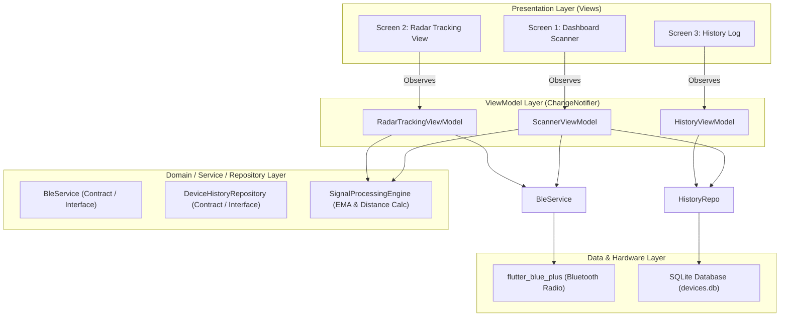

# Technical Architecture & System Specification: BLE Proximity Tracker
**Target Project:** Goodeva Mobile Engineer Study Case  
**Author:** Software Architect  
**Audience:** Senior Flutter Developer & Product Owner  
**Version:** 1.0.0 (Release-Ready Architecture)

---

## 1. Executive Summary & Design Principles

Aplikasi **BLE Proximity Tracker** bertujuan memindai sinyal advertising Bluetooth Low Energy (BLE) secara real-time, mengestimasi kedekatan jarak berbasis RSSI, memberikan visualisasi radar interaktif untuk perangkat target, dan menyimpan riwayat pemindaian ke basis data lokal.

### Prinsip Utama (Anti-Overengineering)
1. **Pragmatic Clean MVVM**: Tidak membuat layer boilerplate yang berlebihan (hindari *UseCases* 1-line atau DTO mapping ganda tanpa nilai tambah). Cukup: `View` $\rightarrow$ `ViewModel (ChangeNotifier)` $\rightarrow$ `Repository / Service` $\rightarrow$ `Data Source (BLE / SQLite)`.
2. **Deterministic Data Flow**: Aliran data dari Bluetooth Hardware adalah *asynchronous reactive stream*. Data diproses melalui pipeline filtering dan smoothing sebelum sampai ke presentation layer.
3. **Resilient by Default**: Kegagalan Bluetooth (adapter mati, izin ditolak, app background) ditangani pada level Service/Repository dan diekspos sebagai status reaktif (`BleState`), bukan exception liar yang menyebabkan crash.

---

## 2. Tech Stack & Library Decisions

| Kategori | Teknologi Terpilih | Justifikasi Teknis |
| :--- | :--- | :--- |
| **Framework** | Flutter 3.47+ (Dart 3.13+) | Multiplatform, performa rendering 60-120 FPS via Impeller/Skia untuk animasi radar. |
| **Arsitektur & State**| **MVVM** (`ChangeNotifier` + `ListenableBuilder`) | Native Flutter, zero-overhead, mudah di-test, dan tidak membutuhkan build-runner generator. |
| **Dependency Injection**| `get_it: ^7.7.0` | Service Locator standar industri Flutter; decoupling sempurna, mempermudah mocking pada Unit Test. |
| **BLE Engine** | `flutter_blue_plus: ^1.35.0` | Library BLE terpopuler, aktif di-maintain, cross-platform Android & iOS, support Android 12+ API 31+. |
| **Penyimpanan Lokal** | `sqflite: ^2.3.3` + `path: ^1.9.0` | Standar industri untuk relational persistence (sesuai kriteria setara Room di Android), handal untuk query riwayat dan atomic upsert. |
| **UI & Design System**| `material_ui: ^1.0.0` | Decoupled Material 3 UI package (standar Flutter 3.47+). |
| **Permission Handler** | `permission_handler: ^11.3.1` | Granular runtime permissions untuk Bluetooth Scan, Connect, dan Location. |
| **Formatting** | `intl: ^0.19.0` | Format timestamp real-time (*last seen* relative/absolute). |

### 2.1. Design System & Theming Strategy (Material Design 3 & Package Decoupling)

1. **Material & Cupertino Decoupling (Flutter 3.47+ Standard)**:
   - Sesuai arsitektur modern Flutter 3.47+, sistem desain Material dan Cupertino telah didecoupling dari core framework ke package mandiri di pub.dev (`material_ui` dan `cupertino_ui`).
   - **Aturan Import & Isolasi Layer**:
     * **Presentation Layer (Leaf Widgets & Views)**: Mengimpor `package:material_ui/material_ui.dart` (bukan lagi `package:flutter/material.dart`).
     * **ViewModel, Service, Model, dan Repository**: **Dilarang** mengimpor `material_ui` atau package desain apapun. Business logic harus murni *design-agnostic* (hanya mengimpor `package:flutter/foundation.dart` untuk `ChangeNotifier` / `ValueNotifier` atau pure Dart).
   - Menghindari pembuatan custom design system yang berlebihan (*anti-overengineering*).

2. **Material Design 3 Dynamic Palette**:
   - Menggunakan `ThemeData(useMaterial3: true)` dengan satu warna dasar (*primary seed*):
     * **Primary Seed**: `const Color(0xFF0066FF)` (Electric Bluetooth Blue).
   - Seluruh warna komponen UI (Card, App Bar, Floating Action Button, Surface, Dialog, dll.) di-generate secara otomatis oleh Flutter melalui:
     ```dart
     // Light Theme (Default)
     ThemeData(
       useMaterial3: true,
       colorScheme: ColorScheme.fromSeed(
         seedColor: AppColors.primarySeed,
         brightness: Brightness.light,
       ),
     )
     ```

3. **Semantic Telemetry Colors (Fixed Domain Constants)**:
   - Warna untuk **6 Kategori Kedekatan Sinyal** diperlakukan sebagai konstanta domain telemetri (seperti lampu indikator) dan **tidak mengikuti dynamic color generation M3** agar tidak terdistorsi:
     * **Sangat Kuat**: `Color(0xFF00C853)` (Green)
     * **Kuat**: `Color(0xFF00B0FF)` (Cyan / Light Blue)
     * **Cukup**: `Color(0xFFFFD600)` (Yellow / Amber)
     * **Lemah**: `Color(0xFFFF9100)` (Orange)
     * **Sangat Lemah**: `Color(0xFFFF1744)` (Red)
     * **Sinyal Hilang (Lost)**: `Color(0xFF9E9E9E)` (Grey)

### 2.2. Dart 3.13+ Modern Idiomatic Standards

Untuk menjaga basis kode tetap bersih, modern, dan memanfaatkan kapabilitas Dart 3.13+:

1. **Dot Shorthands (`.member`)** — [Dokumentasi Resmi: Dot shorthands](https://dart.dev/language/dot-shorthands):
   - Wajib menggunakan sintaks dot shorthand ketika context type sudah diketahui oleh compiler:
     ```dart
     // Rekomendasi Dart 3.13+
     alignment: .center,
     mainAxisAlignment: .spaceBetween,
     fontWeight: .bold,
     colorScheme: .fromSeed(seedColor: AppColors.primarySeed),
     status: .scanning, // Enum shorthand
     ```
2. **Primary Constructors** — [Dokumentasi Resmi: Primary constructors](https://dart.dev/language/primary-constructors):
   - Manfaatkan primary constructor pada deklarasi kelas untuk model data dan DTO guna mengeliminasi boilerplate.
   - **Named vs Positional**: Mendukung baik positional maupun named parameters (`{required ...}`). Untuk model data dengan banyak properti (seperti `BleDeviceModel`), gunakan **named parameter** (`{required String id, ...}`) agar instansiasi dan call-site terbaca jelas dan tidak rentan tertukar, kecuali untuk kelas kecil/sederhana yang secara alami lebih cocok dengan positional parameter:
     ```dart
     // Contoh Primary Constructor dengan Named Parameters
     class BleDeviceModel({
       required final String id,
       required final String name,
       required final int rawRssi,
       required final double smoothedRssi,
       required final double estimatedDistance,
       required final ProximityZone zone,
       required final DateTime lastSeen,
     });
     ```
3. **Omit Redundant Type Annotations (Type Inference)**:
   - Jika tipe data sudah diketahui dari ekspresi inisialisasi di sisi kanan, **jangan definisikan ulang tipe data** di sisi kiri:
     ```dart
     // Tepat:
     static const primarySeed = Color(0xFF0066FF);
     static const scanTimeout = Duration(seconds: 15);
     final devices = <BleDeviceModel>[];

     // Dihindari (Redundant):
     static const Color primarySeed = Color(0xFF0066FF);
     ```
   - **Pengecualian (Sealed Class / Polymorphism)**: Tipe eksplisit tetap diwajibkan ketika variabel memerlukan abstraksi supertype/generic, misalnya:
     ```dart
     final ScannerState state = ScannerInitial(); // Diperbolehkan agar tipe tidak menyempit (narrowed)
     ```
4. **No Hungarian/Prefix on Interfaces (Effective Dart Standard)**:
   - Hindari kebiasaan bahasa lain (Java/C#) yang menambahkan prefix `I` pada interface (seperti `IDeviceHistoryRepository` atau `IBleService`).
   - Panduan resmi *Effective Dart* merekomendasikan penamaan alami:
     * Interface/Contract: `abstract interface class DeviceHistoryRepository`
     * Implementasi: `class DeviceHistoryRepositoryImpl implements DeviceHistoryRepository` (atau deskriptif: `class SqliteDeviceHistoryRepository`)
     * Interface/Contract: `abstract interface class BleService`
     * Implementasi: `class BleServiceImpl implements BleService`
     * Interface/Contract: `abstract interface class PermissionService`
     * Implementasi: `class PermissionServiceImpl implements PermissionService`
5. **Dumb Components & Pure Presentation Pattern**:
   - Seluruh Page/Screen dan Widget wajib dirancang sebagai **Dumb Widgets / Pure Components**:
     * Menerima state/data primitif atau entitas via constructor.
     * Mengalirkan event pengguna ke luar melalui callbacks (`onTap`, `onChanged`, `onPressed`, dll).
     * DILARANG mengakses Service Locator (`locator<...>()`) atau memicu side-effects di dalam dumb widget.
     * Smart Container / Page Wrapper bertugas mengikat ViewModel ke Dumb Widget.
6. **Widget Previews dengan `@BluePulsePreview`**:
   - Setiap Page/Screen, Widget publik, maupun private widget dari sebuah halaman wajib menyertakan preview function dengan anotasi `@BluePulsePreview` (dari `package:blue_pulse/core/utils/preview_annotations.dart`):
     * Argumen `name`: Nama widget / page / state preview (e.g. `name: 'Device Card'`, `name: 'Empty'`).
     * Argumen `group`: Dibiarkan kosong/default untuk widget publik. Khusus **private widget**, isi argumen `group` dengan nama Page/Screen tempat widget tersebut digunakan (e.g. `group: 'ScannerScreen'`).
7. **Absolute Package Imports**:
   - Wajib menggunakan absolute package import di seluruh file project:
     `import 'package:blue_pulse/...'`
   - DILARANG menggunakan relative import (`../../widgets/...` atau `../models/...`).
8. **Pemanfaatan Core Extensions (`extensions.dart`)**:
   - Maksimalkan penggunaan extension yang tersedia di `package:blue_pulse/core/utils/extensions.dart`:
     * `NumX` (`num_ext.dart`): `.allPadding`, `.hPadding`, `.vPadding`, `.hGap`, `.wGap`, `.sliverHGap`, `.radius`, `.r`, `.ms`, `.seconds`.
     * `BuildContextX` (`build_context_ext.dart`): `context.scheme`, `context.text`, `context.mediaQuery`, `context.theme`.
     * `DateTimeX`, `DoubleX`, `IntX`.
   - Hindari deklarasi manual berulang untuk padding, gap/SizedBox, duration, dan radius jika extension sudah menyediakannya.

---

## 3. High-Level System Architecture & Data Flow



---

## 4. Domain Models & Mathematical Specifications

### 4.1. Entity: `BleDeviceModel`
```dart
class BleDeviceModel({
  required final String id, // MAC Address (Android) atau UUID (iOS)
  required final String name, // Advertised Name atau 'Unknown Device'
  required final int rawRssi, // Nilai RSSI mentah (dBm)
  required final double smoothedRssi, // Nilai RSSI setelah filter EMA
  required final double estimatedDistance, // Estimasi jarak dalam meter
  required final ProximityZone zone, // Kategori sinyal berdasarkan tabel studi kasus
  required final DateTime lastSeen, // Timestamp terakhir terdeteksi
  final DateTime? firstSeen, // Timestamp pertama kali terdeteksi
  final int? txPower, // Nilai TxPower pemancar (opsional, default: -59)
});
```

### 4.2. Proximity Zone Mapping (Strict Study Case Specification)
Sesuai tabel pada Dokumen Soal Halaman 2:

| Rentang RSSI (dBm) | Kategori Sinyal | Perkiraan Jarak (Meter) | Representasi UI (Warna/Status) |
| :--- | :--- | :--- | :--- |
| **-10 s/d -30 dBm** | **Sangat Kuat (Sangat Dekat)** | `< 1 meter` | Hijau Terang (`#00C853`), Pulse Cepat |
| **-30 s/d -50 dBm** | **Kuat (Dekat)** | `1 – 3 meter` | Hijau / Cyan (`#00B0FF`), Pulse Normal |
| **-50 s/d -70 dBm** | **Cukup / Baik** | `3 – 10 meter` | Kuning / Amber (`#FFD600`), Pulse Sedang |
| **-70 s/d -80 dBm** | **Lemah** | `10 – 20 meter` | Oranye (`#FF9100`), Pulse Lambat |
| **-80 s/d -90 dBm** | **Sangat Lemah / Putus-putus** | `> 20 meter` | Merah (`#FF1744`), Pulse Pudar |
| **< -90 dBm** | **Sinyal Hilang (Lost)** | `Terputus / Di luar jangkauan`| Abu-abu (`#9E9E9E`), Static / Outline |

### 4.3. Algoritma Estimasi Jarak & Smoothing RSSI
1. **Exponential Moving Average (EMA) untuk Mengatasi Fluktuasi RSSI**:
   Sinyal radio BLE mengalami fenomena *multipath fading*. Untuk mencegah UI melompat-lompat secara drastis:
   $$\text{RSSI}_{\text{smoothed}} = \alpha \cdot \text{RSSI}_{\text{raw}} + (1 - \alpha) \cdot \text{RSSI}_{\text{prev}}$$
   *Parameter Rekomendasi:* $\alpha = 0.35$ (responsif namun halus).

2. **Log-Distance Path Loss Model**:
   $$d = 10^{\left(\frac{\text{TxPower} - \text{RSSI}}{10 \cdot n}\right)}$$
   * $\text{TxPower}$: Sinyal terukur pada jarak 1 meter (konstanta default: $-59\text{ dBm}$ jika tidak di-broadcast oleh beacon).
   * $n$: *Path-loss exponent* lingkungan (konstanta indoor: $2.4$).

---

## 5. Persistence Specification (Local Database)

### 5.1. Database Schema (`devices.db`)
Tabel `device_history` merefleksikan 100% properti `BleDeviceModel`:
```sql
CREATE TABLE device_history (
    id TEXT PRIMARY KEY,
    name TEXT NOT NULL,
    raw_rssi INTEGER NOT NULL,
    smoothed_rssi REAL NOT NULL,
    estimated_distance REAL NOT NULL,
    proximity_zone TEXT NOT NULL,
    tx_power INTEGER,
    first_seen INTEGER NOT NULL,
    last_seen INTEGER NOT NULL
);
CREATE INDEX idx_last_seen ON device_history(last_seen DESC);
```

### 5.2. Repository Policy:
- Saat pemindaian aktif menemukan perangkat, lakukan *upsert* (Insert or Replace) jika ada pembaruan nama atau selisih waktu tertentu (debounce DB write: 1 detik per device untuk mencegah bottleneck disk I/O).
- Layar Riwayat (*Screen 3*) membaca langsung dari tabel ini diurutkan berdasarkan `last_seen DESC`.

---

## 6. Detailed Screen Specifications

### 6.1. Screen 1: Dashboard Utama (Scanner)
- **Header / App Bar**: Status Bluetooth (Aktif / Mati), Jumlah perangkat terdeteksi.
- **Controls**: Tombol Start / Stop Scan yang dinamis dengan visual indikator pemindaian (animasi radar mini / linear progress).
- **Filter Toolbar**:
  - Kolom Search: Instant text filtering berdasarkan `name` atau `id` (MAC/UUID).
  - RSSI Threshold Slider / Chips (misal: "Semua", "≥ -80 dBm", "≥ -60 dBm").
- **List View**:
  - Diurutkan otomatis: **Highest RSSI first** (descending).
  - Item Card: Device Name, MAC, RSSI Badge (dBm), Distance badge (meter), dan Zona Kategori.
  - Klik card $\rightarrow$ Navigasi ke **Screen 2 (Radar View)** dan rekam ke History DB.

### 6.2. Screen 2: Detail Pelacakan (Radar View)
- **Hero Radar Canvas (`CustomPainter`)**:
  - Lingkaran konsentris merepresentasikan 5 zona jarak (1m, 3m, 10m, 20m, >20m).
  - Lingkaran gelombang radar yang berdenyut (*pulsing wave animation*).
  - Target Blip yang bergerak mendekat/menjauh dari titik pusat radar sesuai smoothed RSSI.
  - Warna lingkaran dan blip berubah dinamis sesuai zona tabel (Hijau $\rightarrow$ Kuning $\rightarrow$ Merah $\rightarrow$ Abu-abu).
- **Telemetry Card**:
  - Raw RSSI vs Smoothed RSSI.
  - Estimasi Jarak Numerik (meter) & Label Zona.
  - Signal Stability Meter (dihitung dari standard deviation atau rate packet per detik).
  - Connection/Packet Heartbeat: Indikator "Active" atau "Signal Lost" jika tidak ada packet masuk selama >10 detik.

### 6.3. Screen 3: Riwayat Perangkat (History Log)
- Menampilkan daftar semua perangkat yang pernah terdeteksi dari SQLite.
- Info: Nama, MAC/UUID, Sinyal terakhir, Waktu terakhir ditemukan (*e.g.*, "2 menit yang lalu", "Hari ini 10:45").
- Tombol aksi: "Hapus Riwayat" (Clear all) dan individual delete.

---

## 7. Resilience, Edge Cases & App Lifecycle Strategy

1. **Bluetooth Adapter Mati**:
   - `BleService` mendengarkan stream `FlutterBluePlus.adapterState`.
   - Jika `BluetoothAdapterState.off`, hentikan pemindaian dan tampilkan Banner/Dialog "Aktifkan Bluetooth untuk melanjutkan".
2. **Permission Handling (Android 12+)**:
   - Android API $\ge 31$ membutuhkan: `BLUETOOTH_SCAN`, `BLUETOOTH_CONNECT`.
   - Android API $< 31$ membutuhkan: `ACCESS_FINE_LOCATION`, `ACCESS_COARSE_LOCATION`.
   - ViewModel mengecek status permission sebelum eksekusi `startScan()`. Jika ditolak permanen, sediakan tombol buka `App Settings`.
3. **App Lifecycle Management (`WidgetsBindingObserver`)**:
   - Saat app masuk background (`AppLifecycleState.paused` / `inactive`), panggil `stopScan()` secara otomatis untuk menghemat baterai.
   - Saat kembali ke foreground (`AppLifecycleState.resumed`), jika status sebelumnya aktif memindai, lanjutkan pemindaian secara halus.
4. **Configuration Change (Rotasi Layar)**:
   - State dikelola di ViewModel yang terdaftar di `GetIt` atau dipertahankan di level parent widget, sehingga orientasi landscape/portrait tidak mereset list perangkat atau koneksi radar.

---

## 8. Directory Structure (Clean MVVM)

```text
lib/
├── core/
│   ├── constants/
│   │   ├── app_colors.dart
│   │   └── ble_constants.dart
│   ├── di/
│   │   └── injection.dart          # Service Locator setup (get_it)
│   ├── utils/
│   │   ├── signal_math.dart        # Rumus Jarak & EMA Smoothing
│   │   └── time_formatter.dart     # Relative time formatter
│   └── errors/
│       └── app_exception.dart
├── data/
│   ├── datasources/
│   │   └── local_database.dart     # SQLite Database Helper
│   ├── models/
│   │   └── ble_device_model.dart   # Model & DB Entity
│   └── repositories/
│       └── device_history_repository.dart
├── services/
│   ├── ble_service.dart            # FlutterBluePlus wrapper & lifecycle
│   └── permission_service.dart     # Android/iOS permission engine
├── viewmodels/
│   ├── scanner_viewmodel.dart      # Logic Screen 1 (Scan, Filter, Sort)
│   ├── radar_viewmodel.dart        # Logic Screen 2 (Tracking & Smoothing)
│   └── history_viewmodel.dart      # Logic Screen 3 (Persistence)
├── views/
│   ├── scanner/
│   │   ├── scanner_screen.dart
│   │   └── widgets/
│   │       ├── device_card.dart
│   │       └── filter_bottom_sheet.dart
│   ├── radar/
│   │   ├── radar_screen.dart
│   │   └── widgets/
│   │       ├── radar_canvas.dart   # CustomPainter Radar
│   │       └── telemetry_card.dart
│   └── history/
│       ├── history_screen.dart
│       └── widgets/
│           └── history_card.dart
└── main.dart
```

---

## 9. Implementation WBS for Senior Developer

1. **Milestone 1: Project Setup & Permission Config**
   - Inisialisasi Git repository dan perbarui `.gitignore`.
   - Setup `pubspec.yaml` (`flutter_blue_plus`, `sqflite`, `path`, `permission_handler`, `get_it`, `intl`).
   - Konfigurasi `AndroidManifest.xml` (BLE permissions, uses-feature `android.hardware.bluetooth_le`).
2. **Milestone 2: Core Engine & SQLite Repository**
   - Implementasikan `SignalMath` (EMA Filter & Path Loss formula + Zone mapping).
   - Buat `LocalDatabase` dan `DeviceHistoryRepository`.
   - Buat `BleService` dengan stream scan terpadu dan state management adapter.
   - Setup DI di `injection.dart`.
3. **Milestone 3: Screen 1 - Dashboard Scanner**
   - Buat `ScannerViewModel` dengan auto-sorting RSSI descending, search query, dan slider threshold.
   - Buat `ScannerScreen` lengkap dengan animasi status scan dan kartu perangkat.
4. **Milestone 4: Screen 2 - Radar Tracking View**
   - Buat `RadarTrackingViewModel` dengan target lock dan real-time smoothed RSSI.
   - Buat `RadarCanvas` (`CustomPainter`) dengan lingkaran konsentris dan visualisasi kedekatan dinamis.
5. **Milestone 5: Screen 3 - History Log**
   - Buat `HistoryViewModel` dan `HistoryScreen` untuk menampilkan riwayat *last seen* dari database lokal.
6. **Milestone 6: Edge Cases, Lifecycle & Unit Tests**
   - Terapkan `WidgetsBindingObserver` untuk lifecycle pause/resume.
   - Tulis unit tests untuk `SignalMath` (Zone mapping, formula estimasi jarak) dan `ScannerViewModel` filtering.
7. **Milestone 7: Hilir - README.md & Build APK**
   - Dokumentasikan seluruh arsitektur, setup, kendala/asumsi di `README.md`.
   - Eksekusi `flutter build apk --release`.
